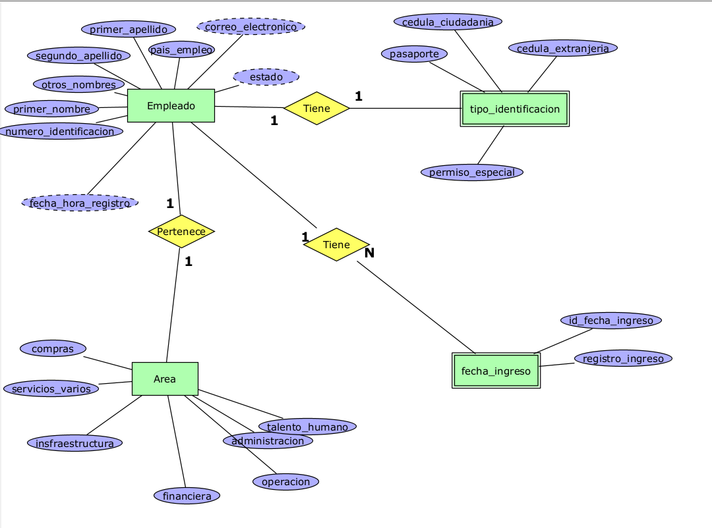

# Sistema-Empleados
Prerrequisitos:
Node.js 

##Prerrequisitos
* NodeJs
* XAMPP
* Composer

##Instalaciones
* Instalacion de Angular
  
```
npm install -g @angular/cli
```
## Modelo Lógico
[](https://github.com/DiegoRivas12)
